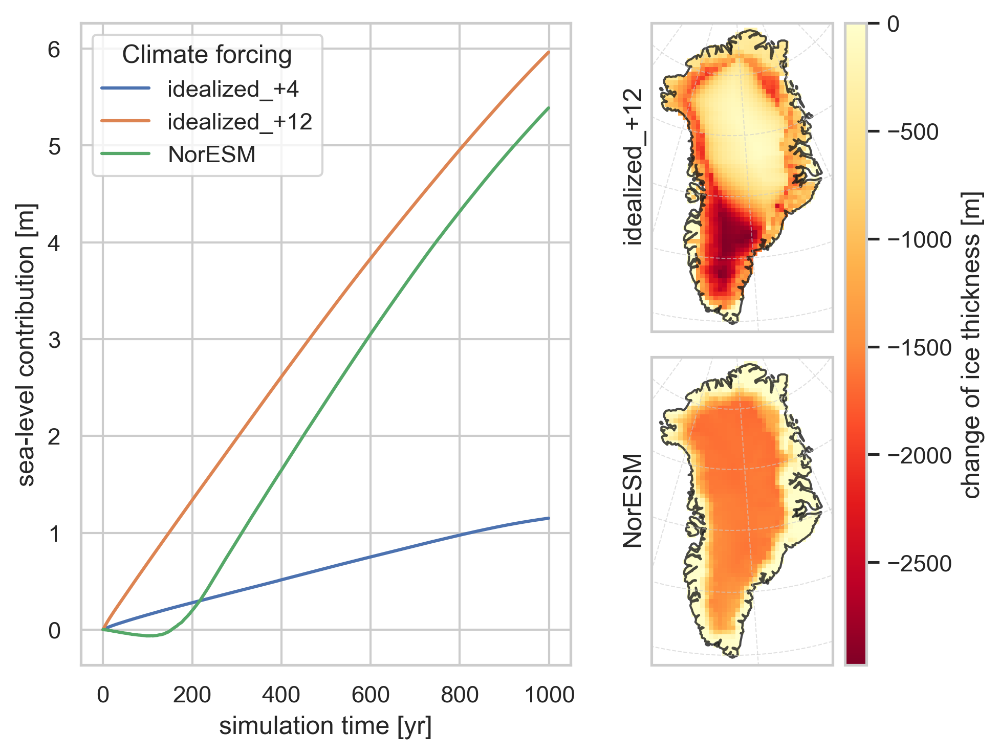

# Simulating the Greenland Ice Sheet Using a Two-Dimensional Ice Flow Model

The two-dimensional ice flow model is written in python. The ice transport equations are numerically
solved in the main model part found in [`2d_model.py`](2d-ice-sheet/2d_model.py), while the surface mass balance is externally
computed and updated in the [`surface_mass_balance.py`](2d-ice-sheet/surface_mass_balance.py) file. The
corresponding parameters for initializing the temperature and precipitation fields are stored
in the `params.py` files in the respective subdirectories.

Some analysis of the model's results can be found in the accompanying [report](2d-ice-sheet/report/main.pdf). This project was part of the GEOV325-Glaciology course at Bergen university.
